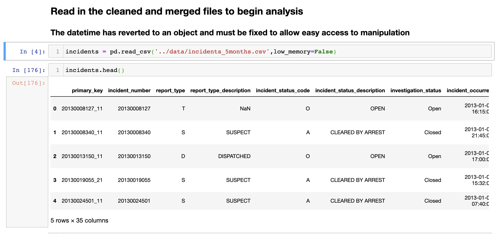
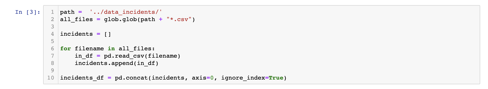
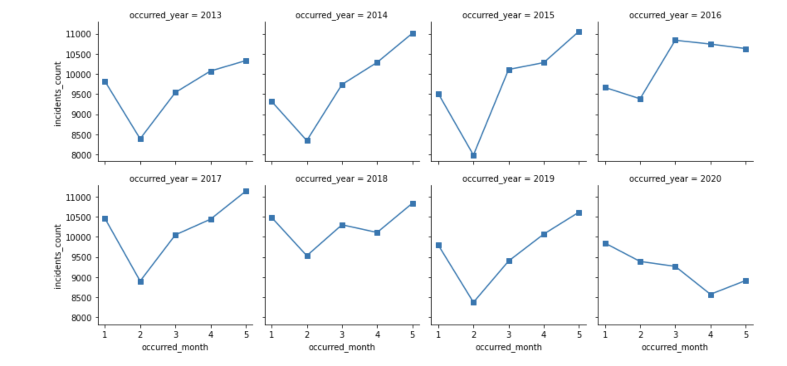

# Incidents Amidst a Pandemic
Look to see if Social Distancing and Stay at Home Orders effects crime incidents
## Table of Contents
* [Technologies](#technologies)
* [General Info](#general-info)
* [Screenshots](#screenshots)
* [Tableau](#tableau)
* [Contact](#contact)
## Technologies
* Python-Jupyter Notebook
* Pandas
* Glob
* Seaborn
* Matplotlib
* Tableau
## General Info
I look closely at the Metro Nashville Police Department's (MNPD) Incident Reports for the months of March, April, and May in 2020 and compare them to the previous four (4) years. I wanted to see the effect Covid-19 might have caused on MNPD's total and type of incidents reported.
## Screenshots
This is the head of the data we will use.

I acquired the data at data.nashville.gov in multiple CSVs and globbed them in python

With a quick value counts I found that 2020 has less incidents than the previous years for the same 3 months

## Tableau
To better visualize what is bringing the Incidents down I made a story board in Tableau https://public.tableau.com/profile/johnborthick#!/

## Contact
Have questions? Contact me at john.borthick@gmail.com.

